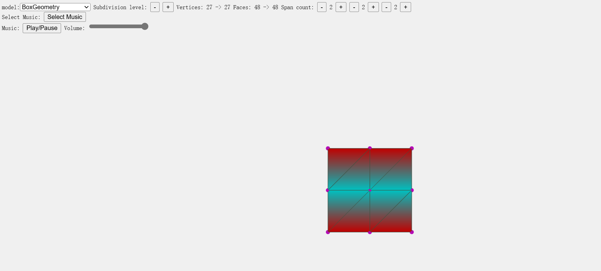

# 几何计算前沿Final

康俊杰 2200013158

## 想法

这个学期学习了JavaScript语言，在做大作业的时候，我想到了课上讲的网格变形，于是打算用JavaScript实现一个网格变形算法。

我选择的是FFD自由变形。

### three.js

为了显示我们需要的三维模型，我们需要使用three.js的几个基本对象：场景（scene）、相机（camera）和渲染器（renderer），这样我们就能通过摄像机渲染出场景。

```JavaScript
import * as THREE from 'three';

const scene = new THREE.Scene();
const camera = new THREE.PerspectiveCamera( 75, window.innerWidth / window.innerHeight, 0.1, 1000 );

const renderer = new THREE.WebGLRenderer();
renderer.setSize( window.innerWidth, window.innerHeight );
document.body.appendChild( renderer.domElement );
```

同时，three.js能让我们简单的创造一些物体并且显示出来：

```JavaScript

const geometry = new THREE.BoxGeometry( 1, 1, 1 );
const material = new THREE.MeshBasicMaterial( { color: 0x00ff00 } );
const cube = new THREE.Mesh( geometry, material );
scene.add( cube );

camera.position.z = 5;
```

最后进行一个**渲染循环**

```javascript
function animate() {
	requestAnimationFrame( animate );
	renderer.render( scene, camera );
}
animate();
```

这样我们就成功在网页中渲染出了一个正方体。

当然，我们还可以给正方体添加一些运动，比如更改animate：

```javascript
function animate() {
	requestAnimationFrame( animate );
	cube.rotation.x += 0.01;
	cube.rotation.y += 0.01;
	renderer.render( scene, camera );
}
animate();
```

这些是最基础的three.js使用方法。在three.js中，我们还可以添加灯光、载入模型等等。

关于本代码使用的three.js的接口介绍写在附件中。

## 功能介绍

我的网页表现是这样的：



* 可以通过拖动控制点自由变形对应模型
* 可以通过model选择选用对应的模型
* 可以增加细分程度，提高模型质量
* 可以增加FFD中的控制点，提升比变形的精确度。
* 可以选择一个背景音乐（只是因为我喜欢听歌）

TODO：添加模型读取能力（有bug）

## 原理解析

自由变形算法主要过程如下：

  1. 创建一个平行六面体的变形空间框架，将待变形几何模型嵌入这个框架中，同时建立局部坐标系，计算几何模型的顶点在局部坐标系下的坐标：

     $s=\frac{T \times U(X-X_0)}{T \times U \cdot S}$

     $t=\frac{S \times U(X-X_0)}{S \times U \cdot T}$

     $u=\frac{S \times T(X-X_0)}{S \times T \cdot U}$

     其中$X_0$ 是局部坐标系原点的世界，**S**、**T**、**U**可认为是这个变形框架的3个边长向量，并且0 < s < 1、0 < t < 1、0 < u < 1

  2. 移动变形框架控制点，利用几何模型顶点的局部坐标(s, t, u)、控制点世界坐标和Bernstein多项式重新计算几何模型每个顶点的世界坐标：

     $Q(x,y,z)=\sum_{i=0}^{L}\sum_{j=0}^{M}\sum_{k=0}^{N}B_{i,L}(x)B_{j,M}(y)B_{k,N}(z)P(i,j,k)
     $

其中$P(i,j,k)$为控制点的新坐标。$B_{k,n}(x)$是Bernstein函数$B_{k,n}(x)=\frac{n!}{k!(n-k)!}x^{k}(1-x)^{n-k}$

## 我的源码介绍

我的代码包括三部分：

“threejs”:three.js库

index.html:HTML，加载了我的JavaScript。

main.js：主要部分代码（部分函数利用AI生成）。

下面我着重介绍main.js：

### main.js

首先在一开始定义了一些全局变量。

然后定义了一个FFD：

FFD中记录了BoundingBox，控制点的位置与数量。同时还有大量的内部函数，方便最后evalWorld的调用。

FFD的意义是封装一个FFD类，更明确的实现了将一个世界坐标系的点转换成FFD变形计算后的点。

紧接着重要的就是function init()。它作用是初始化。我添加了一个div作为整个文档的容器，然后在其中添加了一个用户控件的容器options。接着就按照three.js文档介绍的加载了场景、相机、灯光、渲染器。为了更好的展示与变形，我还添加了相机轨道控制器与物体变换控制器，并给他们附加了相应的事件，以更好的完成镜头的转动与变换。

我使用了 `mouse.x = (event.clientX / window.innerWidth) * 2 - 1; mouse.y = -(event.clientY / window.innerHeight) * 2 + 1;来计算鼠标的相对位置`，利用内置的检测方式来进行控制点的选取与移动。

另一个重要的函数是：updateModel，他的作用是读取我们已经定义的modelLibrary中的模型并更新我们的所有用户空间与场景。

最后是updateOptions，我利用了innerHTML的property来进行用户控件的更新，实现了多种功能。

其他函数的实现相对简单，都是很直观的处理，在这里就不一一介绍了。

## 感想

这次作业主要难度在于阅读three.js并使用，过程有很多曲折，但最后还是比较成功的。

然后是FFD的实现，我阅读了一些介绍后，认为FFD是符合我需求的网格变形。

最后感谢ChatGPT，因为我对JavaScript并不是特别熟悉，有大量的问题是询问ChatGPT得到的。

## 附件：该作业所使用的未提到的three.js中的接口

THREE.Vector2()：表示一个二维向量。

THREE.Vector3：表示一个三维向量。

THREE.Box3：表示三维空间中的一个轴对齐包围盒。本次作业中用于框定模型的四周。

THREE.Geometry：一个基类。

THREE.SphereGeometry：一个用于生成球体的类。本次作业中用于生成控制点。

THREE.Mesh：以三角形组成（多边形网格）的物体的类，是三维中常用的表达。

THREE.MeshBasicMaterial：一个以简单着色（平面或线框）方式来绘制几何体的材质。这种材质不受光照的影响。

THREE.MeshPhongMaterial：一种用于具有镜面高光的光泽表面的材质。

THREE.MeshLambertMaterial：一种非光泽表面的材质，没有镜面高光。

THREE.Line：一条连续的线。用于保存我们的晶格辅助线。

THREE.LineBasicMaterial：一种用于绘制线框样式几何体的材质。

THREE.Raycaster：这个类用于进行光线投射。 光线投射用于进行鼠标拾取（在三维空间中计算出鼠标移过了什么物体）。

THREE.AmbientLight：环境光，会均匀的照亮场景中的所有物体。

THREE.OrbitControls：可以使得相机围绕目标进行轨道运动。

THREE.TransformControls：该类可提供一种类似于在数字内容创建工具中对模型进行交互的方式，来在3D空间中变换物体。 和其他控制器不同的是，变换控制器不倾向于对场景摄像机的变换进行改变。

THREE.SubdivisionModifier：该类可以对三维模型进行细分，使其表面更柔和。
